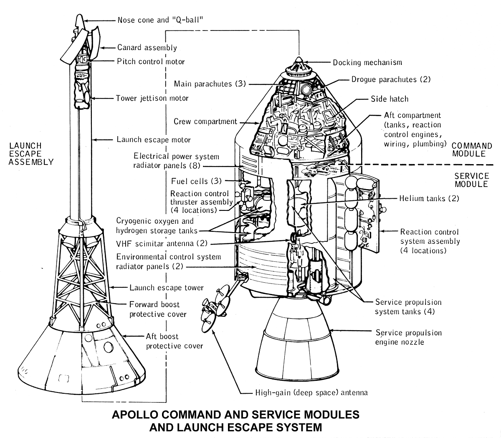
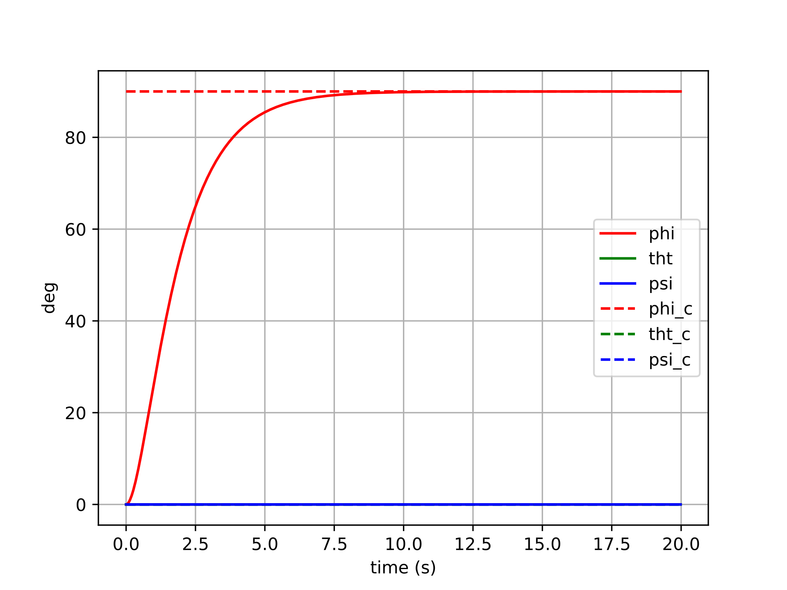
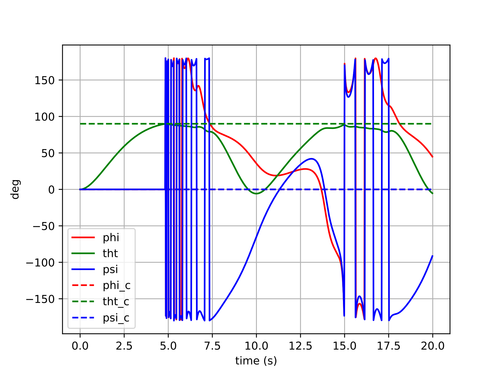
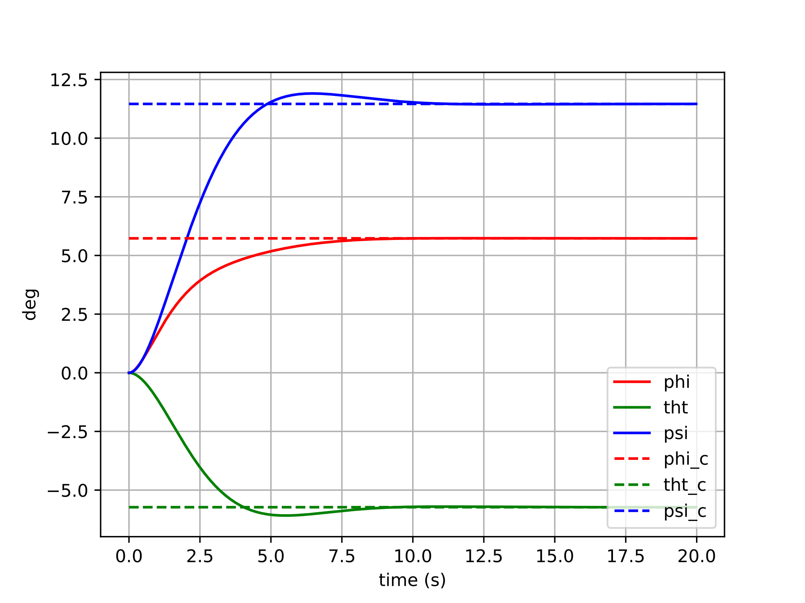
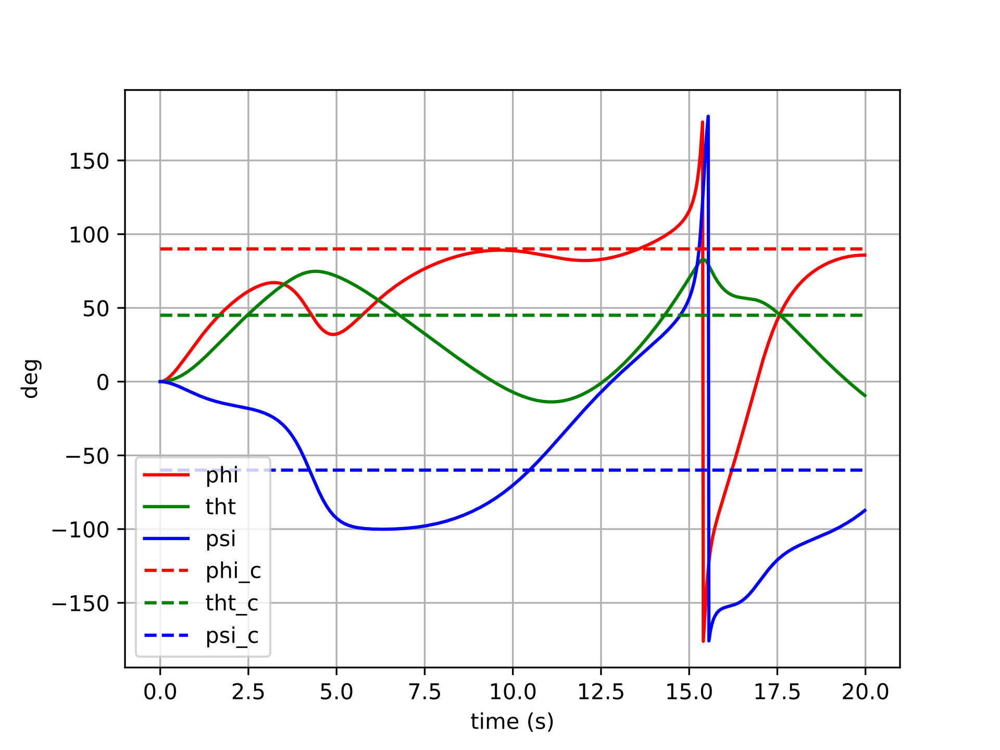
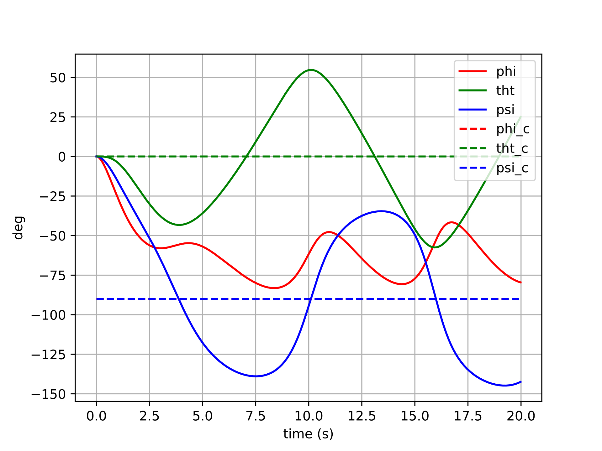
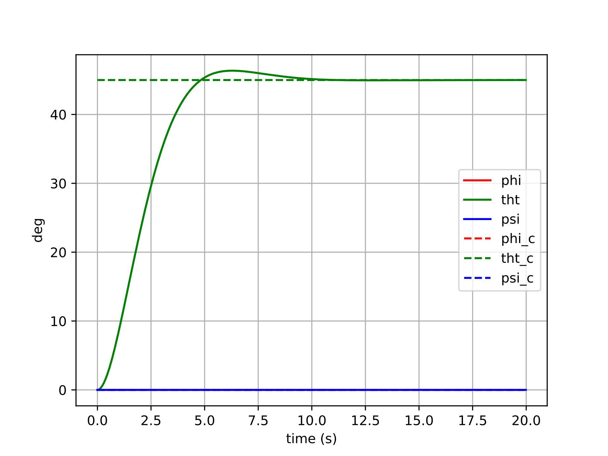
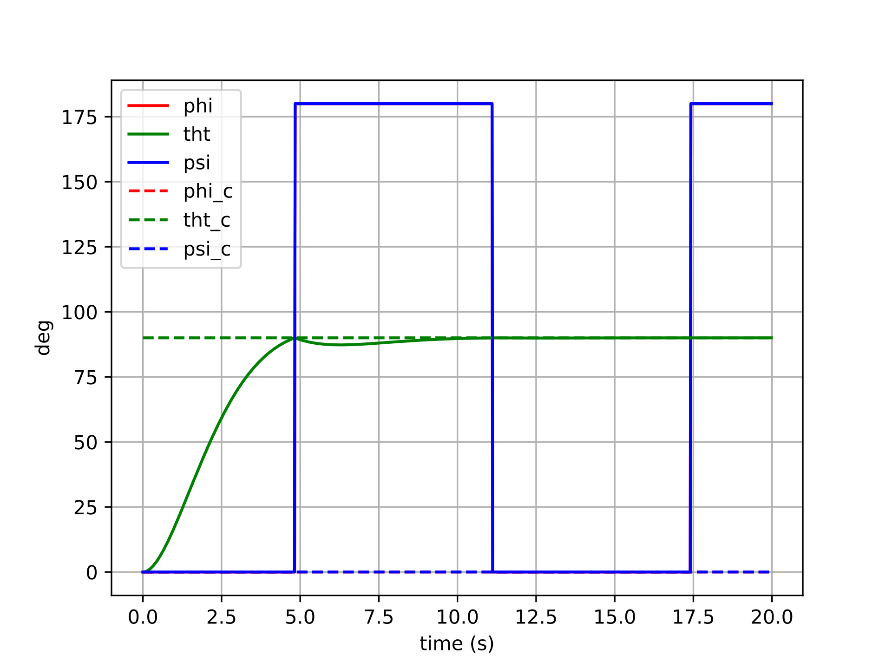

# Apollo Spacecraft Control

An investigation into different forms of attitude control.

All source code used can be found [here](https://github.com/goromal/apollo-att-ctrl/tree/main).

## Motivation

A few years after taking an advanced dynamics course during undergrad, I decided to re-visit the Euler-based dynamics and controls implementations that I had done for that class's final project. After having gained additional experience creating controllers for inner attitude loops on drones, I primarily wanted to show how much more "concise" the controller for this project could be. However, the second and more important purpose for re-visiting this controller was to clearly illustrate the pitfalls of Euler-based attitude control which I've found to be so commonplace in UAV autopilots. Unlike a quadrotor, which may spend most of its flight time close to a hover attitude-wise, a spacecraft will have to exercise control at just about any arbitrary attitude.

## Spacecraft Model

The spacecraft modeled here is the Apollo Command/Service Module, represented as a rigid body rotating freely in three dimensions. Its attitude is parameterized by a unit quaternion \\(\boldsymbol{q} \in SO(3)\\), and its angular velocity \\(\boldsymbol{\omega} \in \mathbb{R}^3\\) is expressed in the body frame. The rotational equations of motion are Euler's equations:

$$\boldsymbol{J}\dot{\boldsymbol{\omega}} = -\boldsymbol{\omega} \times \boldsymbol{J}\boldsymbol{\omega} + \boldsymbol{u}$$

where \\(\boldsymbol{J}\\) is the spacecraft's inertia tensor and \\(\boldsymbol{u}\\) is the applied torque. The kinematic equation relating quaternion rate to body angular velocity is:

$$\dot{\boldsymbol{q}} = \boldsymbol{\omega}$$

(using the \\(SO(3)\\) convention where the quaternion is updated via the exponential map of the angular velocity in the tangent space).

The inertia parameters for the Apollo CSM were sourced from reference data and are used in two forms throughout the simulation:

- **Full inertia tensor** \\(\boldsymbol{J}\\) (with off-diagonal cross terms):

$$\boldsymbol{J} = \begin{bmatrix} 40823.16 & -1537.81 & 3179.30 \\\ -1537.81 & 90593.60 & -128.58 \\\ 3179.30 & -128.58 & 98742.98 \end{bmatrix} \text{ kg·m}^2$$

- **Simplified diagonal inertia** \\(\boldsymbol{J}_\text{simp}\\) (cross terms dropped):

$$\boldsymbol{J}_\text{simp} = \text{diag}(40482.07,\ 90358.43,\ 98637.07) \text{ kg·m}^2$$

The full tensor is used when evaluating controller robustness, while the simplified tensor is used when the controller itself is designed (i.e., model uncertainty is intentionally introduced between the plant and the controller model).

The state is integrated numerically using a fourth-order Runge-Kutta scheme at 50 Hz over a 20-second window.

## Controlling the Spacecraft

### Controller Types

All controllers share the same proportional-derivative structure, commanding a torque that penalizes attitude error and angular rate error:

$$\boldsymbol{u} = -k_q \boldsymbol{e}\_q - k_w \boldsymbol{e}\_\omega + \boldsymbol{u}\_\text{ff}$$

where \\( \boldsymbol{e}\_q \\) is the attitude error, \\( \boldsymbol{e}\_\omega = \boldsymbol{\omega} - \boldsymbol{R}^\top \boldsymbol{R}\_d \boldsymbol{\omega}\_d \\) is the angular rate error expressed in the body frame, and \\(\boldsymbol{u}_\text{ff}\\) is an optional feedback linearization feedforward term.

The controllers differ along three independent axes:

**1. Attitude error formulation** — This is the central comparison of this investigation:

- **Euler error**: The error is computed by subtracting component-wise Euler angles: \\(\boldsymbol{e}_q = [\phi - \phi_d,\ \theta - \theta_d,\ \psi - \psi_d]^\top\\). This is intuitive but relies on a coordinate chart that breaks down near singularities (gimbal lock occurs at \\(\theta = \pm 90°\\)) and produces geometrically incorrect error vectors at large attitude deviations.

- **Tangent space (manifold) error**: The error is computed as the logarithmic map of the relative rotation between the current and desired attitudes on \\(SO(3)\\): \\(\boldsymbol{e}_q = \boldsymbol{q} \ominus \boldsymbol{q}_d = \text{Log}(\boldsymbol{q}_d^{-1} \otimes \boldsymbol{q})\\). This always produces a geometrically meaningful, singularity-free error vector in \\(\mathbb{R}^3\\).

**2. Feedback linearization** — When enabled, additional terms are added to cancel the nonlinear gyroscopic coupling \\(\boldsymbol{\omega} \times \boldsymbol{J}\boldsymbol{\omega}\\) from the dynamics and to account for non-zero desired angular rate and acceleration, yielding a more linear closed-loop response:

$$\boldsymbol{u}_\text{ff} = \boldsymbol{\omega} \times \boldsymbol{J}\boldsymbol{\omega} - \boldsymbol{J}\left(\hat{\boldsymbol{\omega}}\, \boldsymbol{R}^\top \boldsymbol{R}_d \boldsymbol{\omega}_d\right) + \boldsymbol{J}\, \boldsymbol{R}^\top \boldsymbol{R}_d \dot{\boldsymbol{\omega}}_d$$

**3. Inertia model** — The controller can be designed using either the full inertia tensor or the simplified diagonal one. Using the simplified model while simulating against the full tensor tests controller robustness to model mismatch.

The results below focus on the nonlinear (feedback-linearized) controller with the simplified inertia model, commanded to track a step attitude input with full feedforward (desired rate and acceleration included). This setting exercises the controller aggressively and makes the differences between error formulations most apparent.

### Results

#### Controller with Euler Error

Error formulation:

$$\boldsymbol{u}=-k_q\left(\begin{bmatrix}\phi-\phi_d && \theta-\theta_d && \psi-\psi_d\end{bmatrix}^{\top}\right)+\dots$$

The plots below show six different step-command tracking trials for the Euler-error controller. Each trial commands a different target attitude (a step from the identity), varying in the size and axis of the rotation. The solid lines show the actual Euler angles of the spacecraft, and the dashed lines show the commanded Euler angles.

For small commanded rotations (trials 1–2), the Euler-error controller performs reasonably well — the spacecraft converges to the target attitude, though with some cross-axis coupling visible as transient excursions in the non-commanded channels. This coupling arises because the Euler angle error vector is not aligned with the actual rotation axis in body space, so the control effort incorrectly distributes torque across axes.

For larger commanded rotations (trials 3–6), the behavior degrades more noticeably. The cross-axis coupling worsens, and in the most extreme cases the controller may exhibit oscillatory or sluggish transients as the Euler singularity region is approached. The error signal becomes geometrically misleading — commanding large torques along incorrect body axes — and the feedback linearization cannot fully compensate because the underlying error representation itself is wrong.

#### Controller with Tangent Space Error

Error formulation:

$$\boldsymbol{u}=-k_q(\boldsymbol{q}\ominus\boldsymbol{q}_d)+\dots$$

The same six step-command trials are repeated here with the manifold-error controller. All other settings (gains, feedback linearization, inertia model) are identical, so any difference in behavior is attributable entirely to the error formulation.

The manifold-error controller shows cleaner convergence across all six trials. Because the error \\(\boldsymbol{q} \ominus \boldsymbol{q}_d\\) is computed via the logarithmic map on \\(SO(3)\\), it always points along the true geodesic rotation axis — the shortest path from the current attitude to the desired one. This means the control torque is correctly directed in body space regardless of the magnitude or axis of the commanded rotation.

For small rotations, the two controllers produce similar results (consistent with the fact that Euler angles and the tangent space are locally equivalent near the identity). For larger rotations, the manifold controller maintains well-behaved, decoupled tracking: each axis converges independently with minimal excitation of the other channels. There are no singularities to encounter, and no degradation as the commanded attitude grows larger.

## Conclusions

Euler-angle attitude controllers are pervasive in UAV autopilots — and for good reason. Near hover, a quadrotor rarely strays far from the identity attitude, so the Euler singularity is never approached and the coordinate-chart error works well enough. The cost of that simplicity is low.

For a spacecraft, however, arbitrary large-angle maneuvers are routine. In that regime, the Euler error formulation's geometric incorrectness becomes a real liability: cross-axis coupling degrades tracking performance, and any trajectory that approaches the \\(\theta = \pm 90°\\) singularity can cause the controller to behave erratically or fail entirely.

The tangent space error formulation resolves both problems with remarkably little additional complexity. Computing \\(\boldsymbol{q} \ominus \boldsymbol{q}_d\\) via the \\(SO(3)\\) logarithmic map requires only a handful of extra lines of code, yet it yields an error signal that is geometrically valid everywhere on the rotation group — no singularities, no cross-axis distortion, and consistent convergence behavior regardless of the size of the commanded maneuver.

The practical takeaway: the choice of attitude error representation is not merely a mathematical nicety. It is a design decision with real consequences for controller performance, and the manifold-based approach should be the default for any system that exercises significant rotational authority.
