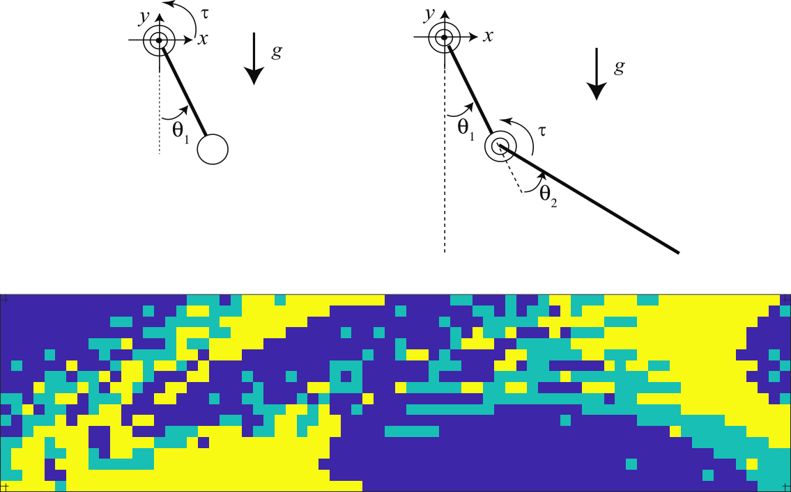

# Dynamic Programming for the Minimum-Time Control of the Inverted Pendulum and Acrobot

Class project for the graduate-level Optimal Control and Estimation course at MIT.

* * *

[Project Paper](https://andrewtorgesen.com/res/16.32%20Final%20Project%20Report.pdf)

* * *

Feedback control of highly nonlinear and chaotic systems is rarely, if ever, a straightforward undertaking. For such systems, linear optimal feedback control laws fail to provide stability unless, perhaps, they are continually re-calculated by iteratively linearizing the nonlinear system about a pre-computed open-loop trajectory from a nonlinear solver. Alternative methods of nonlinear control are often tailored to specific systems by exploiting some idiosyncrasy in their dynamics, as is the case with swing-up controllers.

Unlike nonlinear control methods based on open-loop trajectory optimization or ad hoc designs, dynamic programming offers an alternative closed-loop control option that can be applied to a wide class of highly nonlinear systems. In dynamic programming, heuristic search is used to derive a control policy for the entirety of the state space of the system. The general applicability of dynamic programming methods comes at the cost of high demands on memory usage and computational power in the derivation of the controller, though subsequent application of the derived control strategy requires significantly less resources.

For this project, I applied dynamic programming (in the form of value iteration of the Bellman update equation) to the minimum-time height task for the acrobot, which is a highly nonlinear and chaotic system. The height task entails controlling the acrobot to reach a specified height with a near-zero velocity. Moreover, the minimum-time specification entails restricting the available inputs to some pre-defined saturation values: \\(u \in \{−\tau_\text{max}, 0, \tau_\text{max}\}\\) to complete the height task as quickly as possible. This report details the efforts made to model the problem and the dynamic programming equations, implement them in C++, and apply the derived control strategy in simulation to achieve desired behavior with the acrobot as well as the (simpler) nonlinear inverted pendulum.
