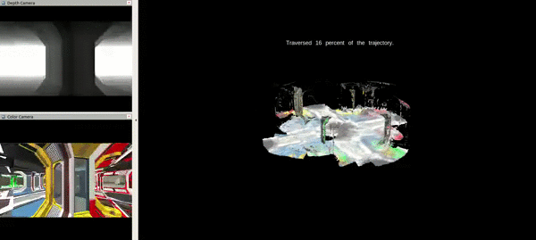

# Multi-agent SLAM for Radiological Search

Research that I did for the Department of Energy.

This work is further expounded on in my [Master's Thesis](https://andrewtorgesen.com/res/thesis.pdf).

* * *

[Project Page](http://acl.mit.edu/projects/cslam-rad-search)

* * *

## Abstract

Remote sensing capability for radiological source localization and mapping is needed in dangerous areas containing one or more radiation sources of unknown location and magnitude. Such scenarios can arise during first-response operations, facilities surveillance, and disaster prevention. Unmanned air vehicles provide an ideal platform for traversing arbitrary terrain when equipped with specialized, lightweight radiation sensors. Previous attempts at remote sensing for radiological search and mapping with air vehicles have focused on single-agent architectures, limiting potential coverage range and time efficiency. Additionally, it is usually assumed that the search environment has been mapped beforehand and that the agent's pose within the search map is universally known, which is often not realistic in time-critical disaster response scenarios or in urban and indoor environments. Past work has demonstrated that the resolution of radiological sensing on a mobile agent platform is greatly improved when fused with agent pose estimates and 3-dimensional map information, which necessitates SLAM capabilities in previously unknown environments. It is conceivable that in a multi-agent setting, a high-resolution sensor such as LiDAR could provide the needed 3D mapping, though its prohibitive weight and cost would limit its ability to be placed on multiple vehicles, leading to dependence on the coverage ability of a single agent and a single failure point. This work aims to expand remote sensing capabilities for radiological source localization by developing and demonstrating a multi-agent collaborative SLAM solution utilizing lightweight depth cameras and a sparse communication network. The decentralization of perception capability facilitates greater robustness, more rapid and widespread mapping ability, and applicability to a larger variety of real-world environments. The effectiveness of the collaborative SLAM platform in facilitating multi-agent radiological search is to be presented and compared with a single-LiDAR architecture both in simulation and on a hardware test platform provided by Lawrence Berkeley National Laboratory.
