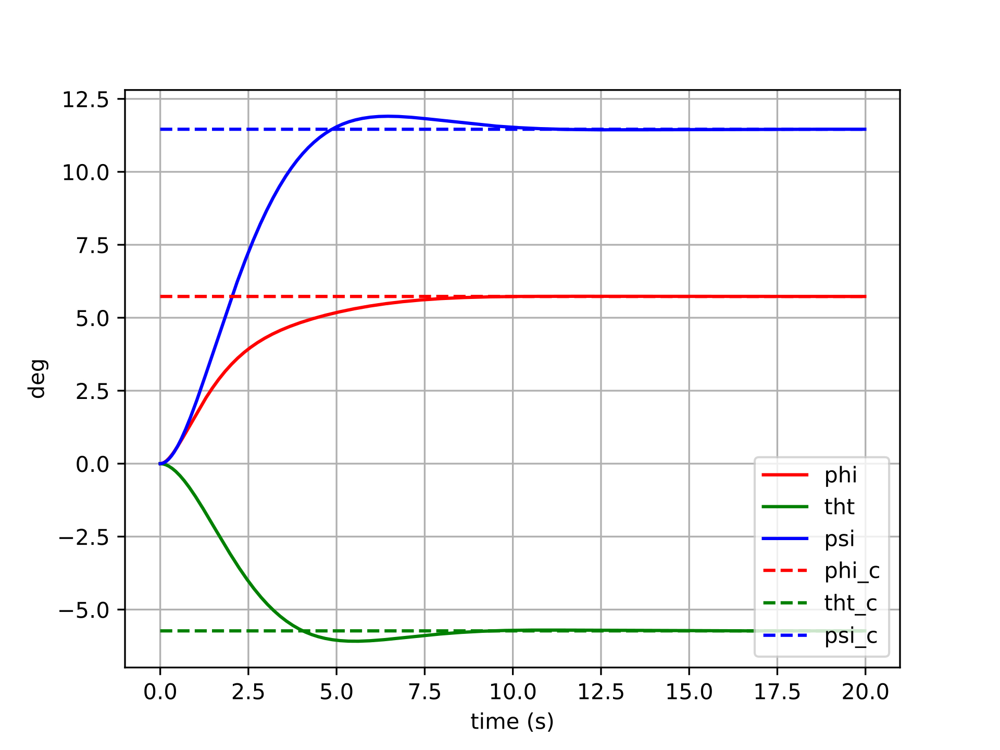
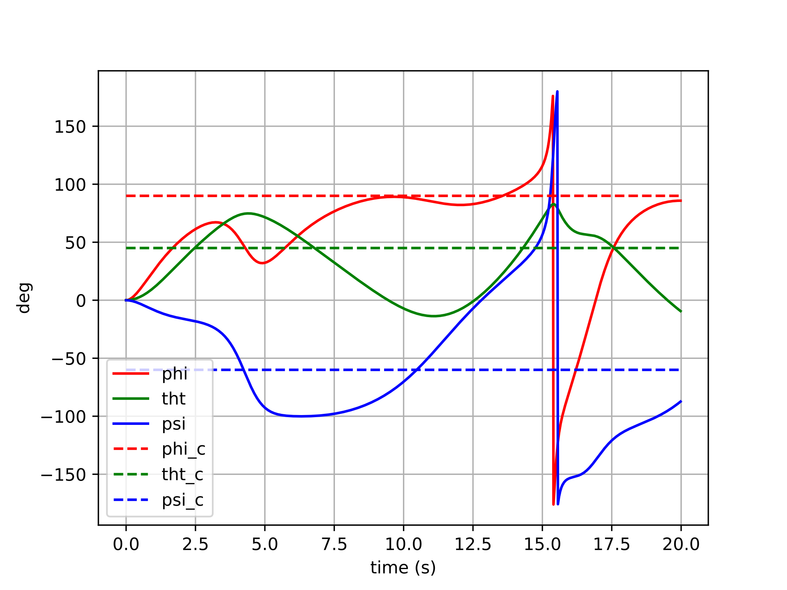

# Apollo Spacecraft Control

An investigation into different forms of attitude control.

***TODO Full project description in progress...***

## Motivation

A few years after taking an advanced dynamics course at BYU, I decided to re-visit the Euler-based dynamics and controls implementations that I had done for that class's final project. After having gained additional experience creating controllers for inner attitude loops on drones, I primarily wanted to show how much more "parsimonious" the controller for this project could be. However, the second and more important purpose for re-visiting this controller was to clearly illustrate the pitfalls of Euler-based attitude control which I've found to be so commonplace in UAV autopilots. Unlike a quadrotor, which may spend most of its flight time close to a hover attitude-wise, a spacecraft will have to exercise control at just about any arbitrary attitude.

## Spacecraft Model

## Controlling the Spacecraft

### Controller Types

### Results

#### Controller with Euler Error

$$\boldsymbol{u}=-k_q\left(\begin{bmatrix}\phi-\phi_d && \theta-\theta_d && \psi-\psi_d\end{bmatrix}^{\top}\right)+\dots$$

#### Controller with Tangent Space Error

$$\boldsymbol{u}=-k_q(\boldsymbol{q}\ominus\boldsymbol{q}_d)+\dots$$

## Conclusions

