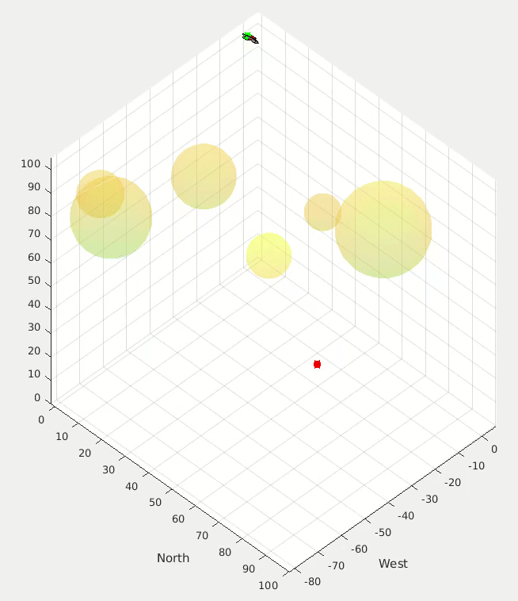
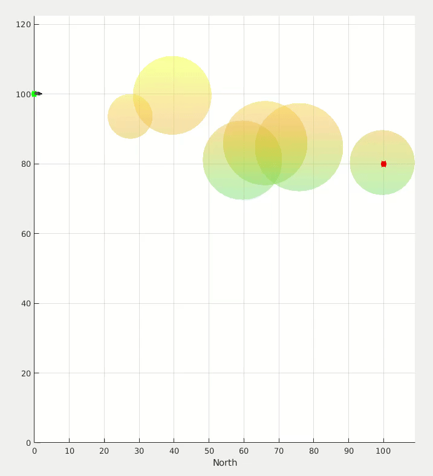

# Genetic Algorithm-Based UAV Path Planner

An application of biologically-inspired optimization algorithms.

* * *
[Check out the paper!](https://andrewtorgesen.com/res/GA%20UAV%20Path%20Planner.pdf)
* * *

**Abstract:** Path planning and obstacle avoidance given a set of waypoints is an important and common problem for autonomous, unmanned air vehicles. There is a large field of research dedicated to solving the problem of efficiently navigating an obstacle field to arrive at a specified location, with wide-ranging algorithmic solutions. This project aims to solve the problem for a small, fixed-wing unmanned air vehicle by formulating the problem as an a-priori optimal control problem and optimizing over possible trajectories using a Genetic Algorithm. The Genetic Algorithm is found to perform well when the closed-loop dynamics of the unmanned air vehicle are approximated by second-order differential equations and the trajectory optimization is formulated as a single-shooting (as opposed to a direct collocation) problem.

 
