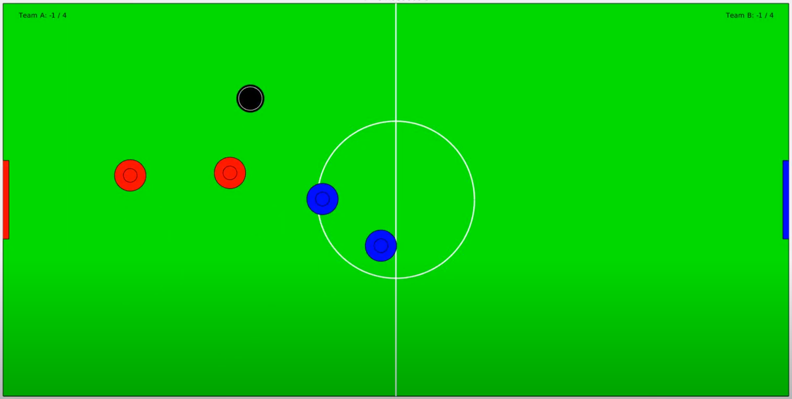

# Multi-Agent Air Hockey

Class project for the graduate-level underactuated robotics course at MIT.

* * *

[Project Paper](https://andrewtorgesen.com/res/UR_Final_Project_Report.pdf)

* * *

**Abstract:** A simulation environment implementing stochastic dynamics and event-based collision detection is created to provide a sandbox for comparing and showcasing the effectiveness of several trajectory optimization techniques in facilitating team performance in an adversarial game of multi-agent air hockey. Among the techniques being compared or showcased are a family of open-loop trajectory optimizations featuring linear, nonlinear, and hybrid solvers. In addition to the open-loop strategies, both decentralized and centralized model predictive control (MPC) formulations are presented and tested in the air hockey environment. The effect of utilizing control barrier functions (CBFs) for centralized collision avoidance is also explored. In comparing the performance of the various control schemes, a regularized strategy is used for each team to avoid confounding the effects of strategy choice and control method. Comparison results suggest that there are inherent tradeoffs between scoring ability and robust obstacle avoidance in dynamic, adversarial environments. Additionally, control barrier functions provide a promising convex method for ensuring obstacle avoidance from a centralized planner.

* * *

I worked on this project with two friends in my lab who also do research in robotics and unmanned aircraft. We wanted to compare the performance of a slew of trajectory optimization algorithms in an entertaining-to-evaluate environment with discontinuous dynamics--a game of simulated air hockey seemed like the perfect choice!

Here are some sample videos:

*60-second game between a decentralized model predictive control (DMPC) strategy (red team) and a centralized model predictive control (CMPC) strategy (blue team)*:

<iframe width="560" height="315" src="https://www.youtube.com/embed/VKunnc5JWt0" frameborder="0" allow="accelerometer; autoplay; encrypted-media; gyroscope; picture-in-picture" allowfullscreen></iframe>

*Trajectory optimization that encodes contact dynamics to score a goal in as little time as possible while obeying dynamic constraints and avoiding obstacles with a "bounce kick"*:

<iframe width="560" height="315" src="https://www.youtube.com/embed/5gcPreTY6mM" frameborder="0" allow="accelerometer; autoplay; encrypted-media; gyroscope; picture-in-picture" allowfullscreen></iframe>

Details can be found in the project paper.
