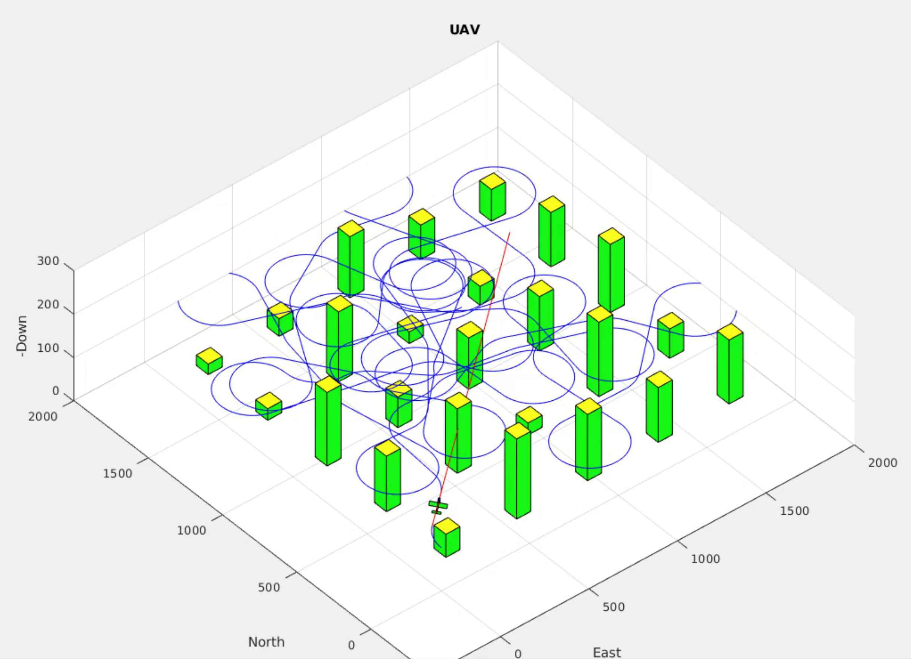

# Fixed-Wing Micro Air Vehicle Simulation

This was a ground-up implementation of simulation and autonomy algorithms in Matlab and Simulink, from dynamic modeling to path planning. In total, this was a culminating implementation of every chapter in the book [Small Unmanned Aircraft: Theory and Practice](https://github.com/byu-magicc/mavsim_public) by Beard and McLain (2012).

<iframe width="560" height="315" src="https://www.youtube.com/embed/0BfB8B8sClY" frameborder="0" allow="accelerometer; autoplay; encrypted-media; gyroscope; picture-in-picture" allowfullscreen></iframe>

